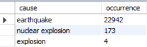

# Earthquake Analysis
___

### Description
___
This project collected and analysed earthquake data across several countries around the globe for a period of 50 years (1969 -2018).

### Table of Contents
___
- [Description](#description)
- [Technologies](#technologies)
- [Data Sources](#data-sources)
- [Usage Instructions](#usage-instructions)
- [Data Cleaning and Preprocessing](#data-cleaning-and-preprocessing)
- [Data Analysis](#data-analysis)
- [Recommendations](#recommendations)
- [References](#references)
- [License](#license)


### Technologies
___
- Microsoft Excel (For data collection)
- MySQL (For Data cleaning, preprocessing, and analysis)


### Data Sources
___
Datasets for this project are stored on the 'dbin_earthquakke_1' and 'dbin_earthquakke_2' files and can be downloaded [here](https://drive.google.com/drive/folders/1ybqvCbjfRq_taRmKwju3S0kqr_XuyWAu?usp=drive_link).


### Usage Instructions
___
- Data analysis was performed on MySQL workbench. MySQL Workbence can be downloaded and installed [here](https://dev.mysql.com/downloads/workbench/).
- On windows machine, enter ``` Windows + E ``` and paste the file path ```C:/ProgramData/MySQL/MySQL Server 8.0/Uploads``` on the file address to go into 'Uploads' folder.
- While in the 'Uploads' folder, create a folder named 'input_files' and copy the downloaded dataset files into this folder 
> [!CAUTION]
> You must perform the Steps above before running the script.
- Open the "earthquake_project_MySQL_queries.sql" on your Database Management System and run the script. This should automatically create and load the datasets into a database and table.
> [!WARNING]
> Run each block of code individually


### Data Cleaning and Preprocessing
___
Dataset has been pre-cleaned. All duplicate, null values and trailing whitespaces removed. 

### Data Analysis
___
- Result 1
```SQL
SELECT DISTINCT cause, COUNT(cause) AS 'occurrence'
FROM earthquake_tb
GROUP BY cause
ORDER BY occurrence desc;
```


An initial SELECT statement on the data reveals that natural phenomena were the leading causes of earthquake. However, it is not immediately clear if these are completely random occurrences or if natural factors (like temperature, topography, etc.) influenced the frequency and magnitude of the earthquakes.

### Recommendations
___

### References
___

### License
___
